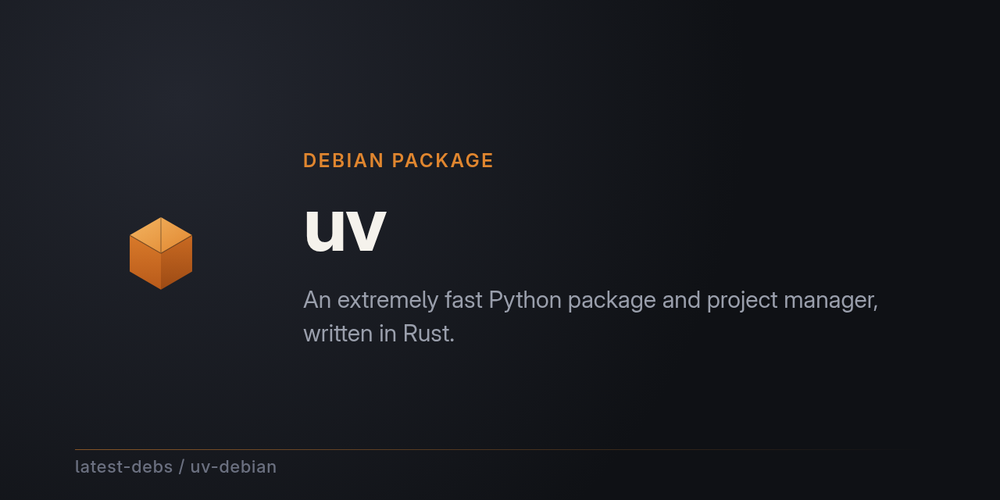

# uv for Debian

[uv](https://github.com/astral-sh/uv) — an extremely fast Python package and
project manager, written in Rust — packaged for Debian as part of
[latest-debs](https://github.com/latest-debs).

## Install

Via the latest-debs apt repository:

```sh
sudo extrepo enable latest-debs
sudo apt update
sudo apt install uv
```

Or download a `.deb` from the [Releases](https://github.com/latest-debs/uv-debian/releases) page:

```sh
sudo dpkg -i uv_*.deb
```

## Supported distributions & architectures

- Debian Bookworm (12), Trixie (13), Forky (14/testing), Sid (unstable)
- amd64, arm64, armhf, i386 (bookworm/trixie), ppc64el, riscv64, s390x

## Building

Run the [Build uv for Debian](../../actions) workflow on GitHub with the
desired upstream version. Packaging is driven by
[debian-multiarch-builder](https://github.com/ranjithrajv/debian-multiarch-builder).

## Maintainers wanted

This package doesn't have a dedicated maintainer yet — **we'd love for you
to sign up!** Maintaining just means keeping an eye on new upstream
releases and build breaks; the build itself is automated. Interested? Open
an issue on this repo to volunteer, or say hello in
[org discussions](https://github.com/orgs/latest-debs/discussions) — all
skill levels welcome.

## Disclaimer

Unofficial packaging only. For issues with uv itself, see
[astral-sh/uv](https://github.com/astral-sh/uv).
